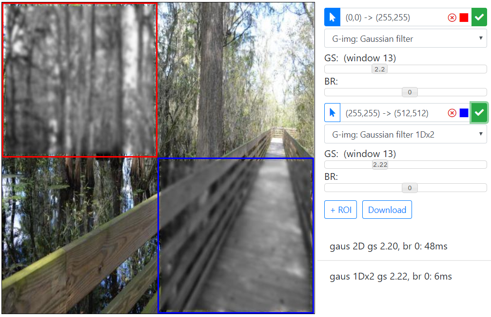

# DIP tools
USF Digital Image Processing project. \
Web app and console for performing image manipulations

### Requirements
DIP operations are written in C language and could be found in iptool folder.
Around C library (dip.dll) there is a wrapper which is written in F# language with use of .NET Core 2.0
Since project is based on .NET Core 2.0, it can be launched on any platform: linux, osx, win. \
But in order to build and run, you need to install dotnet cli. 
Follow [these instructions](https://docs.microsoft.com/en-us/dotnet/core/linux-prerequisites?tabs=netcore2x) to install .NET Core 2.0.

### DIP operations (dip.dll)
Next operations are implemented in iptool/lib.cpp:
1. add (addROI) - image brightenning:
	-	value: int - amount to add to intensity
2. gray (grayROI) - color imaging gray:
	-	grayWay can have int values from set [R=0,G=1,B=2,L1=3,L2=4].
	R means red channel will be used to form gray image, G - green, B- blue.
	L1 - L1 norm (mapped back to [0,255]), L2 - L2 norm (mapped back to [0,255])
3. binarize - binarizaton on gray image with two thresholds (pixels between thresholds become white):
	-	t1 - threshold 1
	-	t2 - threshold 2
4. gausFilter2D - 2D Gaussian filter application with parameters:
	-	gs - standard deviation, also defines window size
	-	br - brightening 
	Gaussian filter sampling is performed by step of 1. So, ws = floor(3*gs), because we are considering \
	values in (-3*gs, 3*gs). Window size then is 2*ws+1.
5. gausFilter1Dx2 - sequantial application of two 1D Gaussian filters. Final image is formed through intermediate one:
	-	gs - standard deviation, also defines window size
	-	br - brightening 
6. binarizeColor - binarization of color images:
	- dist - distance of the pixel to the core
	- rgb(r, g, b) - core in the RGB space. 
	All pixels with rgb vector which is further from core then dist value will become dark. \
	Pixels which are closer then dist will become white.
lib is build with mingw g++ builder - see .vscode/tasks.json or Dockerfile for details how build is done.

### .NET Core wrapper (web mode)
Folder web contains .NET Core 2.0 app which is be default is console app which hosts simple web server (Kestrel)
On start without arguments console app will start to listen for port 5000 and provide full HTTP stack technology support \
for servring requests. 

Inside the web server RESTfull service is hosted. Service accept requests for incoming image 
and incomming image processing. On image operation request, server will call dip.dll and through PInvoke (.NET-native code interoperability) will pass image data, ROI, and operation parameters to operations described previously.
After processing, result image is base64 encoded and sent back as part of JSON response. 
On client side, application rerender image to show algorithm output.
To summarize, workflow is next:

1. User request front page --> index.html is server
2. User selects image --> upload image to server and save it in session data
3. User selects operation --> operation is sent to server and, through dip.dll, calculated. --> Result is served back

Benefits: 
1. Interactive mode of image modification (we can adjust parameters and see results immediatelly)
2. We do not need to use intermediate ppm, pgm files but can work directly with jpg, png. 
.NET core provides wrapper around images in a form of Bitmap object and each pixel of it is accessible in dip.dll
3. Simplified way of loading image into memory (no C stdio functionality is needed)


Current implementation of webUI does not support comfortable way of working with big images for now (additional scaling of image on UI is TBD). 
See build and run section bellow to check how to build .NET Core app.

### .NET Core wrapper (console mode)
.NET Core wrapper can also be launched as console app with provided config json file (analog parameters.txt).
To lauch application in console mode you need to provide "-c config.json" additional arguments on start.
Format of config.json file is next:

```json
{
  "images": 
  [
      {
          "inputFile": "../input/baboon.jpg",
          "outputFile": "../output/b1.jpg",
          "ops": 
              [
                  {
                      "id": "binarize",
                      "parameters": {
                          "t1": 100, 
                          "t2": 200
                      },                         
                      "roi": 
                          {
                              "x1": 200, "y1": 200, "x2":300, "y2":300 
                          }
                  },
                  {
                    "id": "gaus",
                    "parameters": {
                        "gs": 3, 
                        "br": 20
                    },                         
                    "roi": 
                        {
                            "x1": 100, "y1": 100, "x2":200, "y2":200 
                        }
                  }                  
              ]
      }
  ]  
}
```
1. **images** defines list of images to process. 
2. **inputFile** and **outputFile** are selfexplanatory
3. Each operation in **ops** has **id** and **parameters**. Supported values are:
	-	**add**: value (int)
	-	**gray**: way (one of "redChannel", "greenChannel", "blueChannel", "L1", "L2")
    -	**binarize**: t1 (byte), t2 (byte)	
    -	**gaus**: gs (float), br (int)
	-	**gaus1D**: gs (float), br (int)
	-	**binarizeC**: dist (int), r (byte), g (byte), b (byte)
4. Each operation in **ops** can have **roi**:
	- **x1**: top-left corner of ROI, x-coordinate (column index), inclusive
	- **y1**: top-left corner of ROI, y-coordinate (row index), inclusive
	- **x2**: top-right corner of ROI, x-coordinate (column index), exclusive
	- **y2**: top-right corner of ROI, y-coordinate (row index), exclusive
	- if **roi** is not specified - all image is taken as ROI

Benefits of console app:
1. Applicable in automated scripts and mass processing of images
2. Also does not use ppm, pgm	

### Build and run from sources
0. **git clone** https://github.com/dvitel/DigitalImageProcessing.git
1. Create empty lib (mkdir lib) folder at same folder level as iptool and web folder
2. Execute **g++ -c -I. -o ../lib/dip.dll.o lib.cpp** in iptool folder.
3. Execute **g++ -shared -o ../lib/dip.dll ../lib/dip.dll.o** in iptool folder.
4. Execute **dotnet build** in web folder. It should copy dip.dll to output near to web.dll.
5. To run in web mode (start inbuilt web server) execute:
  **dotnet run** in web folder. Then, you can access web page on localhost: http://localhost:5000/api/ui
  Demo is [here](https://www.youtube.com/watch?v=9NOcL9OaTRA)
6. To run in console mode (with config file):
  Create config.json by given format above and execute **dotnet run -- -c config.json** in web folder.
7. You can also publish app into folder 'out' using **dotnet publish -c Debug -o ../out ./web/**. 
  After publishing you will have a folder with all files including web.dll and dip.dll. 
  To start app in the folder: **dotnet web.dll** or **dotnet web.dll -- -c config.json**
8. To deploy in production you can use provided Docker script or use leatest [built container image](https://hub.docker.com/r/dvitel/webdip/) **docker pull dvitel/webdip** 
9. Production deployment is [http://evoparsons.csee.usf.edu:5433/api/ui](http://evoparsons.csee.usf.edu:5433/api/ui)

### Web UI operation examples
1. Graying of the ROI:


2. 2 ROIs with different operations


3. Gray image binarization


4. Color image binarization


5. Blur with Gaussian filter (2D and 1Dx2, same area, same window size)



6. Same effect of blurring by 1Dx2 and 2D Gaussian filter (note performance difference)


### Gaussian filter: 2D and 1Dx2 (correctness check)
In order to check that two implementations produces same output debug tracing was added to C code.
Experiments were conducted with window size of 7 (gs=1) and ROI size of 7,8,9.
Here is comparison of trace outputs which were produced by two methods.

For **gausFilter2D** and ROI ((0,0)->(7,7)):

<pre>
[../input/baboon.jpg] gaus 2D gs 1.00, br 20, ws 7: 3ms
WINDOW:
0.0000  0.0002  0.0011  0.0018  0.0011  0.0002  0.0000  
0.0002  0.0029  0.0131  0.0215  0.0131  0.0029  0.0002  
0.0011  0.0131  0.0585  0.0965  0.0585  0.0131  0.0011  
0.0018  0.0215  0.0965  <b>0.1592</b>  0.0965  0.0215  0.0018  
0.0011  0.0131  0.0585  0.0965  0.0585  0.0131  0.0011  
0.0002  0.0029  0.0131  0.0215  0.0131  0.0029  0.0002  
0.0000  0.0002  0.0011  0.0018  0.0011  0.0002  0.0000  
ROI: 
163   60   43  107  146   99   77  
130   99   41   69  103   68   61  
 81  133   64   53   97   79   61  
 77  142  109   <b>51</b>  102  111   71  
104  124  151   49   75  113   68  
 89   83  170   82   64  110   60  
 49   51  153  137   86  124   53  
ROI*: 
<b>103.2025</b>
RESULT: 
163   60   43  107  146   99   77  
130   99   41   69  103   68   61  
 81  133   64   53   97   79   61  
 77  142  109  <b>103</b>  102  111   71  
104  124  151   49   75  113   68  
 89   83  170   82   64  110   60  
 49   51  153  137   86  124   53  
</pre>

For **gausFilter1Dx2** and ROI ((0,0)->(7,7)):

<pre>
[../input/baboon.jpg] gaus 1Dx2 gs 1.00, br 20, ws 7: 3ms
WINDOW: 
0.0044  0.0540  0.2420  <b>0.3989</b>  0.2420  0.0540  0.0044  
ROI: 
163   60   43  107  146   99   77  
130   99   41   69  103   68   61  
 81  133   64   53   97   79   61  
 77  142  109   <b>51</b>  102  111   71  
104  124  151   49   75  113   68  
 89   83  170   82   64  110   60  
 49   51  153  137   86  124   53  
INTERMEDIATE: 
98.0675  72.2338  72.1766  <b>85.7175</b>  87.7917  100.4150  122.3866  
ROI*: 
<b>103.2025</b>
RESULT: 
163   60   43  107  146   99   77  
130   99   41   69  103   68   61  
 81  133   64   53   97   79   61  
 77  142  109  <b>103</b>  102  111   71  
104  124  151   49   75  113   68  
 89   83  170   82   64  110   60  
 49   51  153  137   86  124   53  
</pre>

So both methods produces same results. By analogy, ROI of size 8 and 9 also were checked.

### Gaussian filter: 2D and 1Dx2 (speedup)
To check speedup in relation to image size with constant window size a set of images with \
size 128x128, 256x256, 512x512, 768x768, 1024x1024, 1536x1536, 2048x2048.

Here is experiment run for window size of 7:

```
Found 14 images
[../input/128x128.jpg] --> ../output/128x128.1.jpg
[../input/128x128.jpg] gaus 1Dx2 gs 1.00, br 20, ws 7: 3ms
[../input/256x256.jpg] --> ../output/256x256.1.jpg
[../input/256x256.jpg] gaus 1Dx2 gs 1.00, br 20, ws 7: 4ms
[../input/512x512.jpg] --> ../output/512x512.1.jpg
[../input/512x512.jpg] gaus 1Dx2 gs 1.00, br 20, ws 7: 20ms
[../input/768x768.jpg] --> ../output/768x768.1.jpg
[../input/768x768.jpg] gaus 1Dx2 gs 1.00, br 20, ws 7: 54ms
[../input/1024x1024.jpg] --> ../output/1024x1024.1.jpg
[../input/1024x1024.jpg] gaus 1Dx2 gs 1.00, br 20, ws 7: 123ms
[../input/1536x1536.jpg] --> ../output/1536x1536.1.jpg
[../input/1536x1536.jpg] gaus 1Dx2 gs 1.00, br 20, ws 7: 359ms
[../input/2048x2048.jpg] --> ../output/2048x2048.1.jpg
[../input/2048x2048.jpg] gaus 1Dx2 gs 1.00, br 20, ws 7: 695ms
[../input/128x128.jpg] --> ../output/128x128.1.jpg
[../input/128x128.jpg] gaus 1Dx2 gs 1.00, br 20, ws 7: 1ms
[../input/256x256.jpg] --> ../output/256x256.2.jpg
[../input/256x256.jpg] gaus 2D gs 1.00, br 20, ws 7: 16ms
[../input/512x512.jpg] --> ../output/512x512.2.jpg
[../input/512x512.jpg] gaus 2D gs 1.00, br 20, ws 7: 65ms
[../input/768x768.jpg] --> ../output/768x768.2.jpg
[../input/768x768.jpg] gaus 2D gs 1.00, br 20, ws 7: 179ms
[../input/1024x1024.jpg] --> ../output/1024x1024.2.jpg
[../input/1024x1024.jpg] gaus 2D gs 1.00, br 20, ws 7: 252ms
[../input/1536x1536.jpg] --> ../output/1536x1536.2.jpg
[../input/1536x1536.jpg] gaus 2D gs 1.00, br 20, ws 7: 584ms
[../input/2048x2048.jpg] --> ../output/2048x2048.2.jpg
[../input/2048x2048.jpg] gaus 2D gs 1.00, br 20, ws 7: 1039ms
```


For window size of 19 we have:
```
Found 14 images
[../input/128x128.jpg] --> ../output/128x128.1.jpg
[../input/128x128.jpg] gaus 1Dx2 gs 3.00, br 20, ws 19: 5ms
[../input/256x256.jpg] --> ../output/256x256.1.jpg
[../input/256x256.jpg] gaus 1Dx2 gs 3.00, br 20, ws 19: 9ms
[../input/512x512.jpg] --> ../output/512x512.1.jpg
[../input/512x512.jpg] gaus 1Dx2 gs 3.00, br 20, ws 19: 45ms
[../input/768x768.jpg] --> ../output/768x768.1.jpg
[../input/768x768.jpg] gaus 1Dx2 gs 3.00, br 20, ws 19: 106ms
[../input/1024x1024.jpg] --> ../output/1024x1024.1.jpg
[../input/1024x1024.jpg] gaus 1Dx2 gs 3.00, br 20, ws 19: 222ms
[../input/1536x1536.jpg] --> ../output/1536x1536.1.jpg
[../input/1536x1536.jpg] gaus 1Dx2 gs 3.00, br 20, ws 19: 638ms
[../input/2048x2048.jpg] --> ../output/2048x2048.1.jpg
[../input/2048x2048.jpg] gaus 1Dx2 gs 3.00, br 20, ws 19: 1209ms
[../input/128x128.jpg] --> ../output/128x128.1.jpg
[../input/128x128.jpg] gaus 1Dx2 gs 3.00, br 20, ws 19: 2ms
[../input/256x256.jpg] --> ../output/256x256.2.jpg
[../input/256x256.jpg] gaus 2D gs 3.00, br 20, ws 19: 111ms
[../input/512x512.jpg] --> ../output/512x512.2.jpg
[../input/512x512.jpg] gaus 2D gs 3.00, br 20, ws 19: 442ms
[../input/768x768.jpg] --> ../output/768x768.2.jpg
[../input/768x768.jpg] gaus 2D gs 3.00, br 20, ws 19: 966ms
[../input/1024x1024.jpg] --> ../output/1024x1024.2.jpg
[../input/1024x1024.jpg] gaus 2D gs 3.00, br 20, ws 19: 1726ms
[../input/1536x1536.jpg] --> ../output/1536x1536.2.jpg
[../input/1536x1536.jpg] gaus 2D gs 3.00, br 20, ws 19: 3862ms
[../input/2048x2048.jpg] --> ../output/2048x2048.2.jpg
[../input/2048x2048.jpg] gaus 2D gs 3.00, br 20, ws 19: 7418ms
```

Plot of times from image size for ws=7 and 19 is given on next chart:


Speedup for ws=7 goes to x1.5 on large images and for ws=19 - to ~ x6 times.